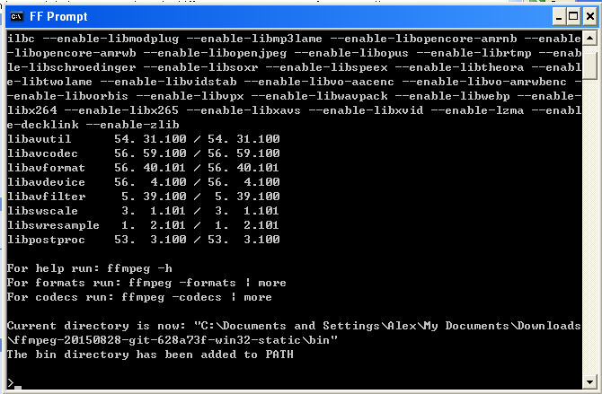

# 运行
## 1.	是这个黑黑的窗口吗？

如果你是一名 Windows&reg; 用户，在第一次运行 ff-promt.bat 的时候，也许会被吓一跳，因为此时出现在屏幕前的，是一个黑底白字——就像在黑客电影中所见到的那样的窗口。  

>	「什么情况？我的电脑坏了？」

你此时心中可能会这样想。但是实际上我想告诉你，你的电脑并没有坏，这个窗口是接下来你要经常面对的东西了。  
别害怕，这并不是什么只有在电影中才能看见的高级玩意儿，在十几至二十几年前，大部分的电脑都是这样子。

>	「可是现在都什么时代了，为什么还要使用这种老土的东西？」

事实上，即使在今天，许多人也在使用它来完成大部分的任务，许多事情还只能靠它来完成。  
图形界面的发明给是计算机界的一大进步，带来了许多好处，但同时的，图形化的东西也有许多缺点。比如，找一个功能需要很多次点击，程序的开发也要消耗许多精力在“如何设置一个好的图形界面”上，图形界面还促使了鼠标手的产生。

我们不得不承认，许多任务，用命令行来完成更高效。 FFmpeg 很好的诠释了这一点。  
命令行没什么好怕的，我天天用呢，如果哪天它突然消失了，我还不知道我该如何使用我的电脑呢。

好了我觉得我在这节内容上耗费太多时间了，本文讲的是 FFmpeg 的用法而不是命令行的优势，再多讲就跑题了。如果你还不服，或者感兴趣，[这篇文章](http://os.51cto.com/art/201007/215287.htm)也许挺适合你。

------------------------

## 2.	查看帮助

首先，打开终端。

-	Linux
	
	我想我不用说了，你们都会。

-	Mac OS X&reg;
	
	点 Dock 中的 Dashboard ，找到 Terminal ，点它。

-	Microsoft&reg; Windows&reg;
	
	按 Win + R ，输入 `cmd` ，回车。

然后，执行以下命令：

	ffmpeg -version

你可以看到像这样的一些输出：

	ffmpeg version 2.7.2 Copyright (c) 2000-2015 the FFmpeg developers
	built with gcc 5.2.0 (GCC)
	configuration: --prefix=/usr --disable-debug --disable-static --disable-strippin  
	g --enable-avisynth --enable-avresample --enable-fontconfig --enable-gnutls --en  
	able-gpl --enable-libass --enable-libbluray --enable-libfreetype --enable-libfri  
	bidi --enable-libgsm --enable-libmodplug --enable-libmp3lame --enable-libopencor  
	e_amrnb --enable-libopencore_amrwb --enable-libopenjpeg --enable-libopus --enabl  
	e-libpulse --enable-libschroedinger --enable-libsoxr --enable-libspeex --enable-  
	libssh --enable-libtheora --enable-libv4l2 --enable-libvorbis --enable-libvpx --  
	enable-libwebp --enable-libx264 --enable-libx265 --enable-libxvid --enable-share  
	d --enable-version3 --enable-x11grab
	libavutil      54. 27.100 / 54. 27.100
	libavcodec     56. 41.100 / 56. 41.100
	libavformat    56. 36.100 / 56. 36.100
	libavdevice    56.  4.100 / 56.  4.100
	libavfilter     5. 16.101 /  5. 16.101
	libavresample   2.  1.  0 /  2.  1.  0
	libswscale      3.  1.101 /  3.  1.101
	libswresample   1.  2.100 /  1.  2.100
	libpostproc    53.  3.100 / 53.  3.100

`version` 的意思就是“版本”，通过这条命令我们就可以看见 FFmpeg 的版本以及其他的一些信息。  
从第一行能够看出，我在写这篇文章时，所使用的 FFmpeg 版本是 2.7.2 ，多数情况下你得到的版本都会比我的新，一般情况下新版本都会保持对旧版本的兼容性，所以版本较新通常不会产生问题。  
但如果你使用的版本比我的旧，即使可能大部分操作都不会出现与本教程不同的地方，但最好还是升到最新版本，也就是按照上一章的方式重新下载最新版。

我们现在知道了 FFmpeg 的版本，接下来需要知道它的使用方法—— FFmpeg 内置了十分详尽的帮助说明，我们可以通过这样一条命令来查看它：

	ffmpeg -help

如果你拥有一定的 Unix 使用经验，对在命令后加 `-help` 来获取帮助的方式应该不陌生。

现在我们获得了这样的输出：

	ffmpeg version 2.7.2 Copyright (c) 2000-2015 the FFmpeg developers
	  built with gcc 5.2.0 (GCC)
	  configuration: --prefix=/usr --disable-debug --disable-static --disable-stripp
	ing --enable-avisynth --enable-avresample --enable-fontconfig --enable-gnutls --
	enable-gpl --enable-libass --enable-libbluray --enable-libfreetype --enable-libf
	ribidi --enable-libgsm --enable-libmodplug --enable-libmp3lame --enable-libopenc
	ore_amrnb --enable-libopencore_amrwb --enable-libopenjpeg --enable-libopus --ena
	ble-libpulse --enable-libschroedinger --enable-libsoxr --enable-libspeex --enabl
	e-libssh --enable-libtheora --enable-libv4l2 --enable-libvorbis --enable-libvpx 
	--enable-libwebp --enable-libx264 --enable-libx265 --enable-libxvid --enable-sha
	red --enable-version3 --enable-x11grab
	  libavutil      54. 27.100 / 54. 27.100
	  libavcodec     56. 41.100 / 56. 41.100
	  libavformat    56. 36.100 / 56. 36.100
	  libavdevice    56.  4.100 / 56.  4.100
	  libavfilter     5. 16.101 /  5. 16.101
	  libavresample   2.  1.  0 /  2.  1.  0
	  libswscale      3.  1.101 /  3.  1.101
	  libswresample   1.  2.100 /  1.  2.100
	  libpostproc    53.  3.100 / 53.  3.100
	Hyper fast Audio and Video encoder
	usage: ffmpeg [options] [[infile options] -i infile]... {[outfile options] outfi
	le}...
	
	Getting help:
	    -h      -- print basic options
	    -h long -- print more options
	    -h full -- print all options (including all format and codec specific option
	s, very long)
	    See man ffmpeg for detailed description of the options.
	
	Print help / information / capabilities:
	-L                  show license
	-h topic            show help
	-? topic            show help
	-help topic         show help
	--help topic        show help
	-version            show version
	-buildconf          show build configuration
	-formats            show available formats
	-devices            show available devices
	-codecs             show available codecs
	-decoders           show available decoders
	-encoders           show available encoders
	-bsfs               show available bit stream filters
	-protocols          show available protocols
	-filters            show available filters
	-pix_fmts           show available pixel formats
	-layouts            show standard channel layouts
	-sample_fmts        show available audio sample formats
	-colors             show available color names
	-sources device     list sources of the input device
	-sinks device       list sinks of the output device
	
	Global options (affect whole program instead of just one file:
	-loglevel loglevel  set logging level
	-v loglevel         set logging level
	-report             generate a report
	-max_alloc bytes    set maximum size of a single allocated block
	-y                  overwrite output files
	-n                  never overwrite output files
	-ignore_unknown     Ignore unknown stream types
	-stats              print progress report during encoding
	-max_error_rate ratio of errors (0.0: no errors, 1.0: 100% error  maximum error 
	rate
	-bits_per_raw_sample number  set the number of bits per raw sample
	-vol volume         change audio volume (256=normal)
	
	Per-file main options:
	-f fmt              force format
	-c codec            codec name
	-codec codec        codec name
	-pre preset         preset name
	-map_metadata outfile[,metadata]:infile[,metadata]  set metadata information of 
	outfile from infile
	-t duration         record or transcode "duration" seconds of audio/video
	-to time_stop       record or transcode stop time
	-fs limit_size      set the limit file size in bytes
	-ss time_off        set the start time offset
	-seek_timestamp     enable/disable seeking by timestamp with -ss
	-timestamp time     set the recording timestamp ('now' to set the current time)
	-metadata string=string  add metadata
	-target type        specify target file type ("vcd", "svcd", "dvd", "dv", "dv50"
	, "pal-vcd", "ntsc-svcd", ...)
	-apad               audio pad
	-frames number      set the number of frames to output
	-filter filter_graph  set stream filtergraph
	-filter_script filename  read stream filtergraph description from a file
	-reinit_filter      reinit filtergraph on input parameter changes
	-discard            discard
	-disposition        disposition
	
	Video options:
	-vframes number     set the number of video frames to output
	-r rate             set frame rate (Hz value, fraction or abbreviation)
	-s size             set frame size (WxH or abbreviation)
	-aspect aspect      set aspect ratio (4:3, 16:9 or 1.3333, 1.7777)
	-bits_per_raw_sample number  set the number of bits per raw sample
	-vn                 disable video
	-vcodec codec       force video codec ('copy' to copy stream)
	-timecode hh:mm:ss[:;.]ff  set initial TimeCode value.
	-pass n             select the pass number (1 to 3)
	-vf filter_graph    set video filters
	-ab bitrate         audio bitrate (please use -b:a)
	-b bitrate          video bitrate (please use -b:v)
	-dn                 disable data
	
	Audio options:
	-aframes number     set the number of audio frames to output
	-aq quality         set audio quality (codec-specific)
	-ar rate            set audio sampling rate (in Hz)
	-ac channels        set number of audio channels
	-an                 disable audio
	-acodec codec       force audio codec ('copy' to copy stream)
	-vol volume         change audio volume (256=normal)
	-af filter_graph    set audio filters
	
	Subtitle options:
	-s size             set frame size (WxH or abbreviation)
	-sn                 disable subtitle
	-scodec codec       force subtitle codec ('copy' to copy stream)
	-stag fourcc/tag    force subtitle tag/fourcc
	-fix_sub_duration   fix subtitles duration
	-canvas_size size   set canvas size (WxH or abbreviation)
	-spre preset        set the subtitle options to the indicated preset

有点长，但别惊慌，我们并不需要理解它全部的内容。

翻到最开始的位置，跳过上面的一大串版本信息什么的，我们能看到一行 `Hyper fast Audio and Video encoder` ，它的意思就是“超快的音频和视频编码器”，这就算是对 FFmpeg 的一句简短的描述了。

接下来的一句 `usage: ffmpeg [options] [[infile options] -i infile]... {[outfile options] outfile}...` 也就代表了 FFmpeg 的主要用法，我们可以看出，一条命令以 `ffmpeg` 开头，后面是可选的选项和参数，输入文件，输出文件……看不懂没关系，用多了自然就明白了。

再下面 `Getting help: ` 这一段，就说明了其他的一些获取帮助的方法， `-h long` 可以看到更为详细的帮助， `-h full` 可以看见超级详细的帮助（相对的，也非常的长）。我们现在只是做最简单的转码，还不需要用到这些高级的选项。

再往下面的内容很多，我就不一一说明了，不要求全都看懂，能看懂一点是一点。左侧是选项的名称，右侧是英文的说明。如果你感兴趣，可以在学会基础的转码以后把每个选项都试一试，这是一个非常好的消磨时间的方法。

----------------------------

## 3.	“选项”与“参数”

既然这是一个以命令行为基础的程序，我们可能需要掌握一些关于命令行的常识。不过，如果你觉得你暂时不想看这些令人头疼的东西，可以先跳过这节。 **如果在之后的部分中遇到了困难，再回来看也不迟。**

在命令行上，一条一长串的命令一般由两部分组成，程序与这条命令的“参数”。比如，在这样一条命令中：

	ffmpeg -i a.mp4 -an -c:v vp9 b.webm

`ffmpeg` 就是程序，而除此之外的后面的东西，也就是 `-i a.mp4 -an -c:v vp9 b.webm` 就是这条命令的参数。

命令的参数还可以再进行更详细的分隔，它以空格做间隔，比如以上的这些参数就被分解成了 `-i`, `a.mp4`, `-an`, `-c:v`, `vp9`, `b.webm` 这 6 段。

以横杠开头的段被称为“选项”，在这个例子中有 `-i`, `-an`, `-c:v` 三个选项。“选项”就像一个开关，在命令中写上它，程序就会知道你要让它做某样事情，否则就会按默认的来。

但是有一些选项不仅仅是一个开关，除了要打开开关以外，你还要告诉它一些额外的信息，这些额外的信息紧跟在选项后面，被称作 **选项** 的参数。比如在这里， `a.mp4` 就是 `-i` 选项的参数， `vp9` 就是 `-c:v` 选项的参数， `-an` 选项不需要参数。

一个选项是否需要参数可以在帮助中找到，比如，在 `ffmpeg -help` 中可以找到这么一行：

	-t duration         record or transcode "duration" seconds of audio/video

这就是对 `-t` 选项的说明，前面的 `-t duration` 表示这个选项需要一个叫 "duration" 的参数。后面的 `record or transcode "duration" seconds of audio/video` 是对这个选项以及参数的解释。在这里它的意思是“录制或编码 "duration" 秒的音频或视频”，通俗地说就是 `-t` 选项是用来指定时间的，后面跟着一个参数，以秒为单位。

如果一个需要参数的选项没有获得它的参数，程序就会出问题，多数情况下，它会报错并给你指示。

最后的 `b.webm` 是一个固有的参数，它不属于任何选项，但是在 FFmpeg 中它被要求写上，因为这就是转码后输出的文件名，它一定要写在最后。看看帮助中的 `usage: ffmpeg [options] [[infile options] -i infile]... {[outfile options] outfile}...` ，我们就能找到我们为什么要这样做——名叫 `outfile` （也就是输出文件）的参数要放在最后面。

**别的程序不一定需要这样的参数，也不一定符合这一节的规律，这里只讲 FFmpeg 。**

---------------------

## 4.	支持哪些格式？

你可能有些踌躇，因为你以前从来没有听说过这个叫 FFmpeg 的软件。“它应该很小众吧”你也许会这样想，“那么支持的媒体格式也很有限咯？”

在第一章我就有描述， FFmpeg 是一个被广泛使用的多媒体编码器库，有多广泛呢？广泛到除了某些财大气粗的商业公司，几乎所有的需要用到媒体的软件都用到了它。之所以你没听说过它的名字，是因为它通常都藏在后端。

现在你不会怀疑 FFmpeg 的支持的格式数量了吧？几乎所有。

跟据 `ffmpeg -help` 的指示，要查看所有支持的“封装格式”，输入 `ffmpeg -formats` ，然后我们会得到一大堆输出，因为实在太长了，我只截一小段给大家看一下：

	File formats:
	D. = Demuxing supported
	.E = Muxing supported
	--
	E 3g2             3GP2 (3GPP2 file format)
	E 3gp             3GP (3GPP file format)
	D  4xm             4X Technologies
	E a64             a64 - video for Commodore 64
	D  aac             raw ADTS AAC (Advanced Audio Coding)
	DE ac3             raw AC-3
	D  act             ACT Voice file format
	D  adf             Artworx Data Format
	D  adp             ADP
	E adts            ADTS AAC (Advanced Audio Coding)
	DE adx             CRI ADX
	D  aea             MD STUDIO audio
	D  afc             AFC
	DE aiff            Audio IFF
	DE alaw            PCM A-law
	D  alias_pix       Alias/Wavefront PIX image
	DE alsa            ALSA audio output

我们能看见许多我们熟悉的格式以及更多不熟悉的格式。

接下来还有他支持的编解码器 (codec) ，按照帮助，我们要输入 `ffmpeg -codecs` ，以下是输出的一部分：

	Codecs:
	D..... = Decoding supported
	.E.... = Encoding supported
	..V... = Video codec
	..A... = Audio codec
	..S... = Subtitle codec
	...I.. = Intra frame-only codec
	....L. = Lossy compression
	.....S = Lossless compression
	\-------
	D.VI.. 012v                 Uncompressed 4:2:2 10-bit
	D.V.L. 4xm                  4X Movie
	D.VI.S 8bps                 QuickTime 8BPS video
	.EVIL. a64_multi            Multicolor charset for Commodore 64 (encoders: a64multi )
	.EVIL. a64_multi5           Multicolor charset for Commodore 64, extended with 5th color (colram) (encoders: a64multi5 )
	D.V..S aasc                 Autodesk RLE
	D.VIL. aic                  Apple Intermediate Codec
	DEVI.S alias_pix            Alias/Wavefront PIX image
	DEVIL. amv                  AMV Video
	D.V.L. anm                  Deluxe Paint Animation

这些就是你电脑中 FFmpeg 所支持的格式和编码了，够多吧？

---------------------

## 5.	中文是世界上最美的语言，但是……

看到这里了，你的心中可能有一个非常大的疑惑，那就是——为什么这个软件只有英语？名字是英语的、帮助是英语的、提示也是英语的。

原因其实显而易见，英语是目前世界上使用人数最多的语言（汉语是 **母语** 人数最多的），而 FFmpeg 的开发者和用户遍布世界各地，它不可能做很多种不同语言的版本，那么既然大家都或多或少看得懂英语，那就采用它了。

如果你觉得你的英语水平看懂这点东西没问题，那真是太好了。如果你觉得你的英语水平还是不够，这也不应该成为你的阻碍。

看不懂怎么办？ <https://translate.google.com/> 上网翻译！

你可能一开始会进度缓慢，看懂一段话都十分困难。但我相信我的读者的脑袋都是足够聪明的，过一段时间你就会发现，这些文档看起来舒服多了。

英语是现代人必备的技能之一，至少在中国大陆，它是属于义务教育中的，如果你觉得“我只是想转个视频，为此学英语成本太高了”，那别怪我嘴下无情——你英语考试多少分？因为我认为，以小学毕业的英语水平，借助网上翻译看懂 FFmpeg 的这点东西还是不难的。

中文是世界上最美的语言，但是英文是世界上使用最广泛的语言。如果你不会英语，那这个世界上你会错过的精彩东西就太多了， FFmpeg 就是其中之一。

不要慌乱，打开翻译，鼠标选中，右键复制，右键粘帖，按下回车。
