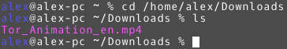
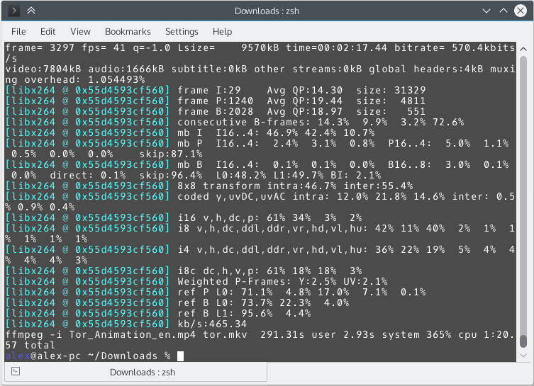
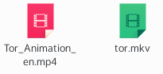

# 开始转码

## 简单的文件输入与输出

>	用 FFmpeg 来执行简单的格式转换出奇的简单！你不相信吗？来试一试就知道了！

首先你要准备一个视频文件，大部分你能见到的视频文件都可以，只要不是有 [DRM 保护](https://zh.wikipedia.org/wiki/%E6%95%B0%E5%AD%97%E7%89%88%E6%9D%83%E7%AE%A1%E7%90%86)的或者某某客户端的“专有格式”，基本上 FFmpeg 都能应付。不过作为练习，最好不要拿太大的文件，因为这样转换的时间会比较长。

我这里使用 [Tor](https://zh.wikipedia.org/wiki/Tor) 的介绍视频来作为例子，可以从[这个页面](https://blog.torproject.org/blog/releasing-tor-animation)来下载到，我所选择的是 [English HQ](https://media.torproject.org/video/2015-03-animation/HQ/Tor_Animation_en.mp4) 版本。当然，如我刚刚所说，你没有必要非得使用这个视频。

假设这个视频已经下载到了你的电脑硬盘中，并存放在 `/home/alex/Downloads/` 这个目录里面，而且 FFmpeg 已经[安装](02-download-and-install.md)到你的电脑中。那么现在[打开终端](03-execute.md#查看帮助)，然后使用 `cd` 命令转到文件所在的位置，比如在我的情况下，运行 `cd /home/alex/Downloads/` ，它不会有任何输出。

-	 **注意：** 如果文件路径包含空格或一些特殊字符，请使用半角引号（ `'` 或 `"` ）将路径名包起来，比如如果文件在 `/home/alex/path with space/` ，执行 `cd "/home/alex/path with space/"` 而 **不是** `cd /home/alex/path with space/` 。

-	 **注意：** 如果你使用的是 Microsoft&reg; Windows&reg; ，并且文件不在 C 盘，需要再“执行”一下盘符，比如如果文件存放在 `D:\\Downloads\` 里面，执行以下两条命令：
	
		cd D:\\Downloads\
		D:

`cd` 完了之后，如果你有强迫症想要检查一下是否真的已经切换到目标目录去了，可以运行 `ls` （ Linux, Mac OS X&reg; ）或 `dir` （ Microsoft&reg; Windows&reg; ）。只要显示出来的确实是那个目录里的文件，就说明没有问题，你可以放心继续。

接下来输入 `ffmpeg` 但不要回车，我们要使用 `-i` [选项](03-execute.md#选项与参数)来指定输入文件。  
输入文件是什么？就是我们要转换的文件呀！比如我在此处要转换的文件叫做 `Tor_Animation_en.mp4` ，我就再往命令行中打 `-i Tor_Animation_en.mp4` 。

在指定了输入文件之后，我们还要指定一个输出文件，不然 FFmpeg 把转换出来的文件保存在哪儿呢？  
输出文件可以是任何名字，但它的后缀名很关键，[上一章](04-media-file-structure.md)已经讲过，后缀名通常就代表着文件的封装格式。在这个例子中，我想将视频转换为 [Matroska](https://zh.wikipedia.org/wiki/Matroska) 格式（俗称 MKV 格式），那么我输出文件的后缀名就得是 `.mkv` 。  
最终，我想将文件保存为 `tor.mkv` ，就在命令行后面直接加上这个文件名。

最后，我的命令行上有着这样一条命令：

	ffmpeg -i Tor_Animation_en.mp4 tor.mkv

-	 **注意：** 跟 `cd` 时的目录路径一样，如果文件名包含空格或一些特殊字符，也需要用半角引号将它们包裹起来。比如如果输入文件名叫 `input file.mp4` 且输出文件名叫 `output file.mkv` ，整条命令就得是 `ffmpeg -i "input file.mp4" "output file.mkv"` 。

按下回车吧！

虽然这一节的内容很长，不过你读过之后应该就会发现，这其实就是这么一条简单的命令。为了使大家更好理解，我才将这一节写的这么详细。

如果你使用的文件很小，而且电脑性能不是特别差，可能你还没有读完上一段话，就已经转换完成了。你的命令行窗口可能看起来像是这样：  

你通常不必去管里面写的是什么，只要没出现红色的 `ERROR` ，一般就是没有问题地完成了。

现在，你闪闪发亮的输出文件已经保存在原来的目录中了。在我这里，这个 `tor.mkv` 就是转换后的输出文件。  

--------------------

## 指定编码器

FFmpeg 会自动判断输入文件的封装格式以及编码，并且根据输出文件的后缀名来判断其封装格式。同时， FFmpeg 也会根据该种封装格式的默认编码来决定输出文件的编码。

运行 `ffmpeg -help muxer=matroska` 就可以查看 Matroska 格式的默认编码了，我们可以在这条命令的输出中找到这样几行字：

	Muxer matroska [Matroska]:
	    Common extensions: mkv.
	    Mime type: video/x-matroska.
	    Default video codec: h264.
	    Default audio codec: vorbis.
	    Default subtitle codec: ass.

它们的意思是： Matroska 封装格式，通常的后缀名为 `mkv` ，[MIME](https://zh.wikipedia.org/wiki/%E5%A4%9A%E7%94%A8%E9%80%94%E4%BA%92%E8%81%AF%E7%B6%B2%E9%83%B5%E4%BB%B6%E6%93%B4%E5%B1%95) 为 `video/x-matroska` ，默认视频编码为 `h264` ，默认音频编码为 `vorbis` ，默认字幕编码为 `ass` 。如果你的[英语水平没问题](03-execute.md#中文是世界上最美的语言但是)，读懂这些将轻而易举。

-	 **注意：** FFmpeg 的版本不同，各种封装格式的默认编码器也有可能不同，请[确认](03-execute.md#查看帮助)你所拥有的 FFmpeg 是最新版本的。

[H264](https://zh.wikipedia.org/wiki/H.264/MPEG-4_AVC) 和 [Vorbis](https://zh.wikipedia.org/wiki/Vorbis) 都是两种十分流行的编码，大部分播放器都可以播放。不过，如果我想使用 Matroska 作为封装格式，但使用 [HEVC](https://zh.wikipedia.org/wiki/%E9%AB%98%E6%95%88%E7%8E%87%E8%A7%86%E9%A2%91%E7%BC%96%E7%A0%81) 作为视频编码，该怎么办呢？

快使用“帮助大法”，执行 `ffmpeg -help` 查看帮助！  
然后我们能看到这样一行：

	-vcodec codec       force video codec ('copy' to copy stream)

它告诉我们，使用 `-vcodec` 选项，可以指定视频编码器。如果指定 `copy` 将不会重新编码，而是直接把原来的媒体流拷贝过去。

现在我们可以在原来的命令（ `ffmpeg -i Tor_Animation_en.mp4 tor.mkv` ）的 **输出文件名之前** ，加上 `-vcodec hevc` ，这样 FFmpeg 就会使用 HEVC 而不是 H264 进行视频的编码。  
最后我们要使用的命令是这样的：

	ffmpeg -i Tor_Animation_en.mp4 -vcodec hevc tor.mkv

按下回车！

如果出现了 `File 'tor.mkv' already exists. Overwrite ? [y/N]` ，不要惊慌，他只是告诉你 `tor.mkv` 这个文件已经存在了，并问你是否要覆盖。如果你要覆盖原来的文件，按 `y` 再回车；如果你不想覆盖，按 `n` 回车，把文件名改一下，再重新执行命令。

这回的等待时间可能就长一些了，因为 HEVC 是一个压缩比更高的编码，需要的时间也长。

同样的，在 `ffmpeg -help` 的输出中，我们也可以找到 `-acodec` 选项，它是用来指定音频编码的。所以如果我想要以 Matroska 作为封装格式， HEVC 作为视频编码， [Opus](https://zh.wikipedia.org/wiki/Opus_codec) 作为音频编码，使用的命令会是这样的：

	ffmpeg -i Tor_Animation_en.mp4 -vcodec hevc -acodec opus tor.mkv

如果我想要直接拷贝媒体流到输出文件中而不重新进行编码（也就是只转换一下封装格式），在编码器的位置上写 `copy` 。比如 `ffmpeg -i Tor_Animation_en.mp4 -vcodec copy -acodec copy tor.mkv` ，因为这样不进行编码，所以通常会很快。

-	 **提示：** `-vcodec` 有一个缩写叫做 `-c:v` ， `-acodec` 有一个缩写叫做 `-c:a` 。  
	也就是说， `ffmpeg -i Tor_Animation_en.mp4 -vcodec hevc -acodec opus tor.mkv` 可以写为 `ffmpeg -i Tor_Animation_en.mp4 -c:v hevc -c:a opus tor.mkv` ，两者没有任何区别。  
	使用这样的小把戏可以省下打几个字母的时间。以后我举例也一直都会用这种简单的写法。

---------------------------

## 照它说的做

[AAC](https://zh.wikipedia.org/wiki/%E9%80%B2%E9%9A%8E%E9%9F%B3%E8%A8%8A%E7%B7%A8%E7%A2%BC) 是一种被十分广泛使用的音频编码，也是 [MP4](https://zh.wikipedia.org/wiki/MP4) 封装格式的默认音频编码。 FFmpeg 当然也对此提供了支持。那么现在我将我的视频转换为 Matroska 封装格式， HEVC 视频编码， AAC 音频编码吧！

可是，我在运行 `ffmpeg -i ffmpeg -i Tor_Animation_en.mp4 -c:v hevc -c:a aac tor.mkv` 的时候，它出错了，还以红色字体显示：

	[aac @ 0x55fcc749c580] The encoder 'aac' is experimental but experimental codecs
	are not enabled, add '-strict -2' if you want to use it.

这是什么情况？难道 FFmpeg 不支持 AAC 吗？  
当然不是，忽略程序给出的错误提示是不应该的，我们来看一看这条错误提示吧！

它说，编码器 `aac` 是实验性的，但是它没有被启用，如果你想使用他的话就加上 `-strict -2` 。

既然 FFmpeg 告诉了我们要加上 `-strict -2` ，那我们就照他说的做，在输出文件之前加上这两个选项。不用管它究竟是什么意思，加就是了。

	ffmpeg -i Tor_Animation_en.mp4 -c:v hevc -c:a aac -strict -2 tor.mkv

好，这样就顺利完成了。

FFmpeg 在出错的时候总会尽它的一切力量来减少你的麻烦，在它能做到的时候，甚至会手把手告诉你如何来解决，而且它的解决方式也通常是最有效的。即使它不能，也会给出详细的错误信息，方便你找到问题、上网搜索或请教别人。

>	人生苦短，我看错误提示。

---------------------

## 学会看输出

别看 FFmpeg 只有一条命令来让用户完成操作，实际上，它告诉你的信息多的令人惊讶！

在执行了上一节最后给出的命令后，我的终端窗口冒出了大量的字符，但是还没等我看完，就迅速被这样的信息给填满了：

	frame=   28 fps=0.0 q=0.0 size=       2kB time=00:00:01.49 bitrate=  11.3kbits/s
	frame=   30 fps= 17 q=-0.0 size=      13kB time=00:00:01.49 bitrate=  71.1kbits/
	frame=   34 fps= 15 q=-0.0 size=      20kB time=00:00:01.66 bitrate=  99.9kbits/
	frame=   38 fps= 13 q=-0.0 size=      31kB time=00:00:01.83 bitrate= 138.1kbits/
	frame=   42 fps= 12 q=-0.0 size=      40kB time=00:00:02.00 bitrate= 165.1kbits/
	frame=   46 fps= 11 q=-0.0 size=      49kB time=00:00:02.17 bitrate= 185.4kbits/
	frame=   50 fps= 10 q=-0.0 size=      57kB time=00:00:02.34 bitrate= 199.3kbits/
	frame=   54 fps= 10 q=-0.0 size=      63kB time=00:00:02.51 bitrate= 204.9kbits/
	frame=   58 fps=9.5 q=-0.0 size=      74kB time=00:00:02.68 bitrate= 226.2kbits/
	frame=   62 fps=9.2 q=-0.0 size=      85kB time=00:00:02.68 bitrate= 260.5kbits/
	frame=   65 fps=8.8 q=-0.0 size=      92kB time=00:00:02.85 bitrate= 264.9kbits/

这些是什么玩意儿？我没有看到我的进度条，也没有百分比，难道我要在这里干等着，不知道什么时候转码才会结束吗？

FFmpeg 确实不会显示进度条和百分比，不过，它会给你比进度条和百分比还要多的信息。

1.	最左边的 `frame=   65` 是转码所进行到的[帧](https://zh.wikipedia.org/wiki/%E5%B8%A7)数，显示 65 就表示现在已经转到了第 65 帧。
2.	第二个 `fps=8.8` 中的 FPS 就是 **F**rame **p**er **S**econd ，也就是现在电脑每秒所处理的帧的数量。注意这个数字跟视频的帧率并无关系。
3.	~~其实我也不知道后面那个 `q=-0.0` 是什么意思，大家不要来打我呀。~~
4.	接下来的 `size=      92kB` 表示现在已经转换出来的视频的体积，这个数字只会越变越大啊。
5.	第五个 `time=00:00:02.85` 顾名思义就是时间了，它是已经转换出来的视频的时间。在我看来，它也是一个比百分比进度条更加精准的进度显示。

如果你认为这么多信息是“无用的”，那么只要看 `time` 这一栏就好，我想你应该知道你原来的视频有多长，那么从已经转换的时间应该能看出你已经完成了多少了吧？

话说回来，在我的终端被这些信息刷屏之前，出来的一大堆~~看起来很不错的~~文字是什么？  
让我们用鼠标滚轮滚回去看看。

	ffmpeg version 2.8 Copyright (c) 2000-2015 the FFmpeg developers
	built with gcc 5.2.0 (GCC)
	  configuration: --prefix=/usr --disable-debug --disable-static --disable-stripp
	ing --enable-avisynth --enable-avresample --enable-fontconfig --enable-gnutls --
	enable-gpl --enable-ladspa --enable-libass --enable-libbluray --enable-libfreety
	pe --enable-libfribidi --enable-libgsm --enable-libmodplug --enable-libmp3lame -
	-enable-libopencore_amrnb --enable-libopencore_amrwb --enable-libopenjpeg --enab
	le-libopus --enable-libpulse --enable-libschroedinger --enable-libsoxr --enable-
	libspeex --enable-libssh --enable-libtheora --enable-libv4l2 --enable-libvorbis 
	--enable-libvpx --enable-libwebp --enable-libx264 --enable-libx265 --enable-libx
	vid --enable-shared --enable-version3 --enable-x11grab
	  libavutil      54. 31.100 / 54. 31.100
	  libavcodec     56. 60.100 / 56. 60.100
	  libavformat    56. 40.101 / 56. 40.101
	  libavdevice    56.  4.100 / 56.  4.100
	  libavfilter     5. 40.101 /  5. 40.101
	  libavresample   2.  1.  0 /  2.  1.  0
	  libswscale      3.  1.101 /  3.  1.101
	  libswresample   1.  2.101 /  1.  2.101
	  libpostproc    53.  3.100 / 53.  3.100
	Input #0, mov,mp4,m4a,3gp,3g2,mj2, from 'Tor_Animation_en.mp4':
	  Metadata:
	    major_brand     : mp42
	    minor_version   : 0
	    compatible_brands: mp42isomavc1
	    creation_time   : 2015-03-12 15:36:45
	    encoder         : HandBrake 0.9.5 2011010300
	  Duration: 00:02:17.45, start: 0.000000, bitrate: 842 kb/s
	    Stream #0:0(und): Video: h264 (Main) (avc1 / 0x31637661), yuv420p(tv, bt709)
	, 1920x1080 [SAR 1:1 DAR 16:9], 674 kb/s, 24 fps, 24 tbr, 90k tbn, 180k tbc (def
	ault)
	    Metadata:
	      creation_time   : 2015-03-12 15:36:45
	      encoder         : JVT/AVC Coding
	    Stream #0:1(eng): Audio: aac (LC) (mp4a / 0x6134706D), 48000 Hz, stereo, flt
	p, 163 kb/s (default)
	    Metadata:
	      creation_time   : 2015-03-12 15:36:45
	x265 [info]: HEVC encoder version 1.7
	x265 [info]: build info [Linux][GCC 5.1.0][64 bit] 8bpp
	x265 [info]: using cpu capabilities: MMX2 SSE2Fast SSSE3 SSE4.2 AVX
	x265 [info]: Main profile, Level-4 (Main tier)
	x265 [info]: Thread pool created using 4 threads
	x265 [info]: frame threads / pool features       : 2 / wpp(17 rows)
	x265 [info]: Coding QT: max CU size, min CU size : 64 / 8
	x265 [info]: Residual QT: max TU size, max depth : 32 / 1 inter / 1 intra
	x265 [info]: ME / range / subpel / merge         : hex / 57 / 2 / 2
	x265 [info]: Keyframe min / max / scenecut       : 24 / 250 / 40
	x265 [info]: Lookahead / bframes / badapt        : 20 / 4 / 2
	x265 [info]: b-pyramid / weightp / weightb / refs: 1 / 1 / 0 / 3
	x265 [info]: AQ: mode / str / qg-size / cu-tree  : 1 / 1.0 / 64 / 1
	x265 [info]: Rate Control / qCompress            : CRF-28.0 / 0.60
	x265 [info]: tools: rd=3 psy-rd=0.30 signhide tmvp strong-intra-smoothing
	x265 [info]: tools: deblock sao
	Output #0, matroska, to 'tor.mkv':
	  Metadata:
	    major_brand     : mp42
	    minor_version   : 0
	    compatible_brands: mp42isomavc1
	    encoder         : Lavf56.40.101
	    Stream #0:0(und): Video: hevc (libx265), yuv420p, 1920x1080 [SAR 1:1 DAR 16:
	9], q=2-31, 24 fps, 1k tbn, 24 tbc (default)
	    Metadata:
	      creation_time   : 2015-03-12 15:36:45
	      encoder         : Lavc56.60.100 libx265
	    Stream #0:1(eng): Audio: aac ([255][0][0][0] / 0x00FF), 48000 Hz, stereo, fl
	tp, 128 kb/s (default)
	    Metadata:
	      creation_time   : 2015-03-12 15:36:45
	      encoder         : Lavc56.60.100 aac
	Stream mapping:
	  Stream #0:0 -> #0:0 (h264 (native) -> hevc (libx265))
	  Stream #0:1 -> #0:1 (aac (native) -> aac (native))
	Press [q] to stop, [?] for help
	frame=   28 fps=0.0 q=0.0 size=       2kB time=00:00:01.49 bitrate=  11.3kbits/s

这些数据可有点多啊，我不会把每一句话都作详细说明，只是挑一些用处比较大的讲一下。

上面的版本信息不用管，然后我们能看到一行 `Input #0, mov,mp4,m4a,3gp,3g2,mj2, from 'Tor_Animation_en.mp4':` ，显然这下面就是关于第 0 个输入文件的信息了。（别忘了，在 IT 界，许多东西都喜欢以 0 而不是 1 开始计数）

`Duration: 00:02:17.45, start: 0.000000, bitrate: 842 kb/s` 这一行告诉我们这个视频长度是 2 分 17 秒 45 ，从 0.000000 开始，比特率 842 kb/s 。

下面一行很长，不过我们只看前面一段 `Stream #0:0(und): Video: h264` ，它告诉我们， 0 号输入文件的 0 号媒体流，视频流， `h264` 编码。

然后是 `Stream #0:1(eng): Audio: aac` ， 0 号输入文件的 1 号媒体流，音频流， `aac` 编码。

再往下 `x265 [info]` 开头的一大堆，都是 HEVC 的编码程序 `x265` 所给出的信息，看不懂就甭管了。

后面我们就能看到关于输出文件的信息，还有其编码。

接下来重要的信息来了：

	Stream mapping:
	  Stream #0:0 -> #0:0 (h264 (native) -> hevc (libx265))
	  Stream #0:1 -> #0:1 (aac (native) -> aac (native))

媒体流的分配，很直观，我们能看到输入文件的视频流从 `h264` 转成了 `hevc` ，音频流从 `aac` 还是转成了一样的 `aac` 。从这里你可以快速的检查一下，你是否输入了你想要执行的命令。

哦，还不能忘记最后一条很有用的信息， `Press [q] to stop, [?] for help` ，它告诉你在转码的时候按 q 来中断， ? 来查看帮助。有经验的人可能知道用 Ctrl + C 可以中断，不过那个是强制退出，按 q 是相对自然一些的中断。

按 ? 会出来什么呢？感兴趣的话就自己来探索一下吧。

>	谁掌握了输出，谁就掌握了程序。
