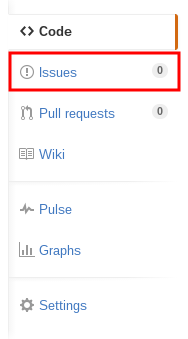

# 反馈问题的步骤

你在阅读本教程的时候发现了问题吗？那欢迎将这个问题反馈给我！

这个问题可以是语法错误、错别字，也可以是不清晰的表述，也可以是内容的错误、缺失，希望我加上一些内容。无论何种问题，都能代表你对我这个计划的支持。

在这里，我将覆盖一些基本的反馈问题的步骤。

## 这个问题真的应该反馈给我吗？

在反馈问题之前，请你想一下，这个问题真的应该反馈给我吗？

虽然说所有类型的反馈都能代表对我的支持，不过不合理的反馈有可能会给我带来困扰。

为了避免复杂的说明，我举几个例子吧。

1.	假如你发现了一个错别字或者语法错误，但不确定这个字是否是真的错了，那就查一下字典吧。中华文字博大精深，有些看似错字其实是对的，有些看似正确实际上是错的。

2.	如果你发现教程中的一些步骤无法被执行，请先上网搜索，这是否是一些其他的原因导致的问题。如果是的话，那就不怪我了。

3.	如果你想知道更高深的内容，那或许反馈问题让我加上不是一个好主意，关于这点，可以看看第 8 章中的[学会看文档](08-differente-encoders-special-options.md#learn-to-look-document)一节。

4.	如果你身处中国大陆，并发现这个教程中有一些外部超链接无法打开，请不要立即将其认为是我的失误，请[检查你的互联网连接][check connection]。在解决连接问题后，再看看是否打得开。

请只有你在确认这个问题是适合反馈给我的时候，再将问题反馈给我，谢谢大家的理解。

## 何处反馈？

我这个计划的全部内容都托管在了 [GitHub](https://github.com) 上，这是目前世界上最大的开源代码托管站（虽然我的教程应该算不上代码），你也许不知道这个网站，这很正常，因为其名声基本只在程序员之间……

GitHub 提供了一套非常良好的 Issues 系统，用来追踪 bug 之类的东西，那对我而言就是让大家来反馈教程中问题的地方。这套系统非常好用，因为它就是被设计成用来反馈问题的。

不过你有可能不知道这个东西，或者比较懒，于是就打算在我的帖子（不论是贴吧还是 G+ ）或者博客的评论中反馈问题。嘛，这样可以是可以的，我也不好因此对你不满，但是评论系统不是设计用来管理问题的，所以用它来反馈不是一个非常好的事情。最好的反馈平台还是 GitHub 的 Issues 。

## 要登录才能反馈？

要反馈问题，首先得有一个 GitHub 帐号，这也许对于不少人来说是个不小的门槛，不过我也没有什么办法，只好劳烦没有帐号的你注册一个帐号了。

你注册了帐号我不会得到任何利润，因为 GitHub 也不是我开的。 GitHub 是一个大公司，还十分[有骨气](https://program-think.blogspot.com/2015/03/weekly-share-82.html?q=github&scope=all)，所以你可以放心的注册一个帐号。

要注册，打开 GitHub 的主页： <https://github.com> ，你能看见网页中间靠右的地方有 3 个白色的文本框和 1 个绿色的注册按钮，第一栏写一个用户名，第二栏写你的邮箱地址，第三栏写一个密码，再按按钮就可以了。接下来只要再做一些平常注册一个帐号所需要做的事情（比如验证邮箱），你就拥有一个 GitHub 帐号了。

## 已经有人反馈了吗？

打开我这个计划的 [GitHub Repository][repo] ，然后点网页右侧的 Issues ，就能进入相应的 Issues 页面了。  

如果是手机，往下翻，翻到一个上面写着 Issues 的方框，点 View all issues 。

现在里面找找有没有与你相似的问题，如果有，点进去看一下吧。一个 Issue 就像一个帖子，你也可以回复这个 Issue ，来进行讨论。或者点右边的 Subcribe 按钮，以后你就会收到这个 Issue 以后的评论和动向了。

## 怎么起笔？

在 Issues 页面，点右上方绿色的 New issue 按钮，手机的话，点左上角的铅笔图标，就可以开始发新 Issue 了。

一个 Issue 就像一个帖子一样，所以你也没必要注意使用什么格式，只要在标题中简明扼要的概括一下问题，内容中详细说明一下就可以了。

比贴吧和 G+ 高级的是， Issue 的内容支持 [Markdown 语法](http://wowubuntu.com/markdown/)，你可以用一个星号包围在文字的两侧来表示斜体，两个星号包围表示粗体。

	*我会变成斜体*
	**我会变成粗体**

还可以放链接和图片：

	[链接显示的文字](链接)
	

在电脑上，你可以把图片拖到浏览器窗口中来插图片，在手机上的话……就得靠 [Imgur](https://imgur.com) 这样的图片托管网站了。

## 然后呢？

然后我就会收到一条提醒：有人来给我反馈问题了。那么，我将感激不尽。

[repo]: https://github.com/FiveYellowMice/how-to-convert-videos-with-ffmpeg-zh
