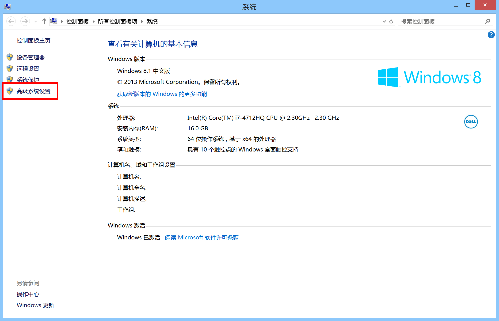
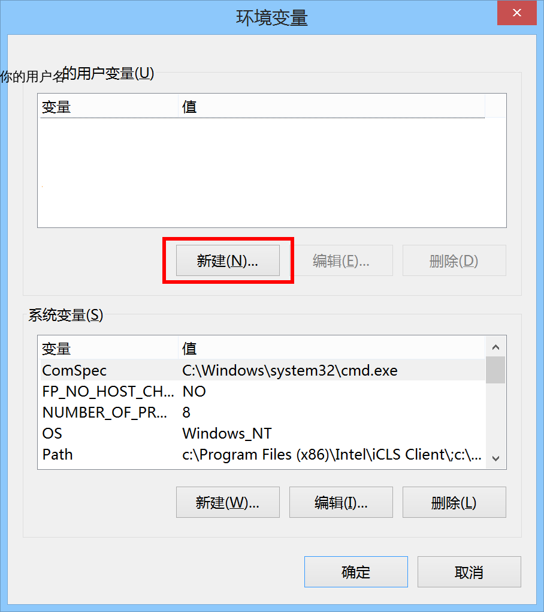

# 在 Microsoft&reg; Windows&reg; 下使用 FFmpeg 将字幕编入视频流时的额外说明

## 废话

要将字幕从文本变成可以显示出来的文字，[字体](https://zh.wikipedia.org/wiki/%E5%AD%97%E4%BD%93)是必须的，播放器在显示独立字幕文件或字幕流的时候需要在电脑中找到合适的字体，才能将字幕渲染到屏幕上， FFmpeg 在将字幕编入视频流的时候也是如此。

FFmpeg 在找字体的时候，会使用一个叫做 [Fontconfig](https://zh.wikipedia.org/wiki/Fontconfig) 的程序，这个程序是为[类 Unix](https://zh.wikipedia.org/wiki/%E7%B1%BBUnix%E7%B3%BB%E7%BB%9F) 系统设计的，所以在 Linux 以及 Mac OS X 上，它工作地很好。

但是， Microsoft&reg; Windows&reg; 没有实现大部分的 [POSIX](https://zh.wikipedia.org/wiki/POSIX) 接口，所以 Fontconfig 无法在它上面正常的工作，进而 FFmpeg 无法找到字体，将字幕编入视频流也是无从谈起。

-	 **安利：** 虽然这篇文章将指导你解决 Fontconfig 在 Microsoft&reg; Windows&reg; 上工作不正常的问题，但是为了你的精神、财富和智慧，[切换到 Linux](https://program-think.blogspot.com/2013/10/linux-newbie-guide.html) 才是最佳的选择。

## fonts.conf

`fonts.conf` 是 Fontconfig 用来存储其配置的文件，在 Linux 下它已经存在与系统中了，而在 Microsoft&reg; Windows&reg; 下没有。

因为没有，所以我们就得自己写一个，好在已经有现成的了。将[这个文件](fonts.conf)的内容复制并保存为文本文件，命名为 `fonts.conf` 。将这个文件放到 `C:\\Users\用户名\` 里，比如如果你的用户名叫 Alex ，就放到 `C:\\Users\Alex\` 里面。

-	 **Windows XP ：** 文件应该放到 `C:\\Documents and Settings\用户名\` 里面。

接下来，在“计算机”（ Windows 7 ）或“这台电脑”（ Windows 8 或更高版本）上右键，选择“属性”。  
在出来的窗口中的左边，点击“高级系统设置”（图中红框部分）。

-	 **Windows XP ：** 在“我的电脑”上右键后将直接打开“系统属性”窗口。

在出来的“系统属性”窗口中，选择“高级”选项卡，再在其中点击“环境变量”按钮。

在“环境变量”窗口中的上半部分（“ XX 的用户变量”），点“新建”按钮。

在“变量名”中，写 `FONTCONFIG_FILE` ，在“值”中写上 `fonts.conf` 文件的路径，也就是 `C:\\Users\用户名\fonts.conf` 。

-	 **Windows XP ：** 路径应该是 `C:\\Documents and Settings\用户名\fonts.conf` 。

点“确定”，再点“确定”，再点“确定”。  
这样就完成了。

## 后果

以后再执行 FFmpeg 的时候，会停顿一段时间，这段时间是 Fontconfig 在加载字体。时间长短因字体数量而异。

这段停顿的时间确实很令人不爽，但是没办法，谁叫 Windows 不支持 POSIX 接口呢。
